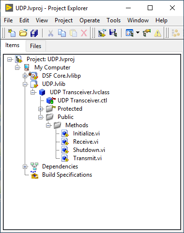
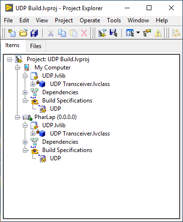
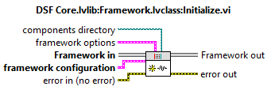
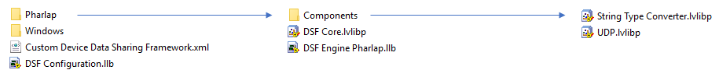
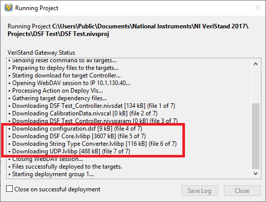

Creating Custom Components
==========================

Create the Component
--------------------

1. Create a LabVIEW project for your component(s).

**Note**: It's recommended that you create two projects: Development and Build. Because this framework uses classes, they won't be editable when loaded under multiple target contexts. Use the Build project to include all your supported target types, which will lock the classes, and the Development project with just 'My Computer' to allow the classes to be edited.

2. Add a LabVIEW library to the project. This is the library that will be built into the components packed project library (PPL), and the name of this library will be the name of your component.

3. Add DSF Core.lvlibp to the project.

**Note**: There is a different Framework PPL for each target type supported by the Framework, since PPLs are binaries built against specific runtimes and CPU architectures. To ensure component classes don't break when building for different target types, the name of the core Framework Core PPL is always 'DSF Core.lvlibp' to ensure class inheritance does not break across all targets. When building for multiple target types, the DSF Core PPL must be swapped out on disk for each target type you build for. Because of this, it is recommended to use the Windows version of the DSF Core PPL in the Development project for your component, and then use the Build project for PPL swapping and building for each target type.

4. Add classes to your library for each of the component classes you would like to override and configure them to inherit from the corresponding classes within the DSF Core PPL.

5. Create a Packed Library Build Specification for your component's library.

**Example**: UDP

Building the Component
----------------------

1. Replace the DSF Core PPL, on disk where it is referenced by your component source code, with the target version (Windows, PharLap, etc.) to build against.

**Note**: Because the Framework itself is a PPL and the components are built against different versions of the Framework PPL based on target type, this means each component will have one built PPL per chosen target type.

2. Open the component's Build project. Verify that your classes and their methods are not broken by opening them under the same target type as the replaced DSF Core PPL type selected before.

3. Build the packed library build specification to create the component PPL for the current target type.

**Example**: UDP

Using the Component
-------------------

### LabVIEW

The Framework loads components from the path provided to the Framework's _Initialize_ method. Simply choose a directory, place the component PPLs there, and the Framework will locate and load them by name at runtime.

### VeriStand

When a system configuration is deployed, the Data Sharing Framework custom device automatically looks for a 'Components' folder under the corresponding target folder in the Data Sharing Framework custom device folder. Simply place built components for each target type under their corresponding folder, and the custom device will automatically move to necessary files to your RT Target for you.

