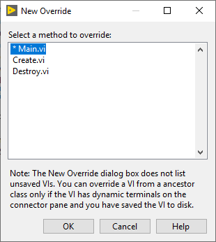
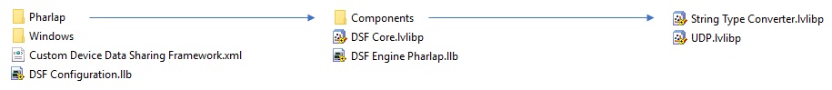
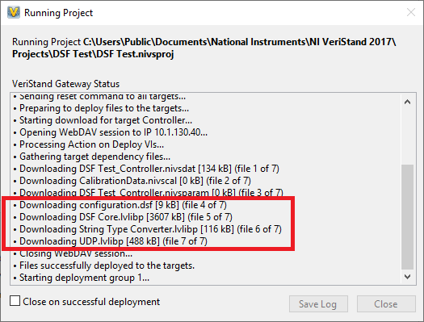

Overview
========

The Data Sharing Framework is a plugin-based architecture that schedules the transfer of data in and out of a core engine data table. It dynamically loads classes from disk at runtime based on a user-provided JSON configuration file to initialize plugin threads, and then schedules the execution of transfers utilizing these threads.

Structure
---------

The Framework is structured to be a series of increasing forms of data encapsulation, starting with individual Channels up to the Plugins that will interact with them.

### Channel

An individual channel located within a Buffer. In VeriStand, this corresponds directly to a data channel in a custom device.

### Transfer

Transfers represents a single block of channel data to be transmitted or received by the Framework. It is comprised of three buffers, and each of these buffers represent channel data intended to be sent as a part of this transfer. The engine buffers (both inline and async) store the data according to each channels? engine data type, and the string buffer according to each channel's string data type. The engine buffer requires all channels be contiguous, but the string buffer uses an offset value to allow channels to be placed anywhere in the buffer, even if there are gaps between channels.

### Transfer Group

Transfer Groups group together an array of Transfers that should be executed with the same timing (decimation and offset) values, while adding information on the direction (Tx or Rx) of the transfers.

### Thread

A thread executes different Transfer Groups for a given Plugin.

### Plugin

A Plugin can be single or multi-threaded based on its configuration and defines how its threads execute.

Memory Management
-----------------

### Buffer Class

The Framework uses a Buffer class for all buffers created for a configuration at runtime. The Buffer class inherits from a Pointer class provided by the LabVIEW Memory Manager library to perform memory operations such as allocation, deallocation, memory copies, etc. By using this library, all Buffers in the Framework store a U64 address field that can be directly accessed and passed to other code/libraries, such as C/C++ DLLs/SOs, for direct memory access of Buffer data.

The Framework maintains three distinct Buffers for each of the Transfers and Transfer Groups at runtime:

### Inline Buffer

The inline engine buffer. This buffer encapsulates inline channel data (i.e. VeriStand Engine channels) for use with inline operations. When operations are async, this buffer gets copied to the async buffer.

### Async Buffer

The async engine buffer. This buffer is a copy of the inline buffer for use with asynchronous operations. The Framework handles migrations of data to and from this buffer automatically.

### String Buffer

The string buffer. This buffer is used to store a converted form of the engine buffer channels for transfer. A Buffer Converter implementation builds and parses this buffer.

Multithreading
--------------

### Thread Class

The Framework provides a base Thread class, which all other Thread classes inherit from.

#### Execution

When a thread is launched, it executes within a Time Sequence Structure which contains the top-level state machine. This allows threads to be run on certain CPU cores and at specific priorities.

##### States

1. **Idle** - The thread is idle and ready to be transitioned to the Run state.
2. **Run** - The thread begins running, which calls the thread-s Main dynamic dispatch method (shown below).
3. **Error** - If the thread returns an error from the Run state, it enters this state and waits to be reset.
4. **Shutdown** - The state when the thread exits the top-level state machine and closes.

#### Methods

This class controls provides some dynamic dispatch methods that can be overridden to customize what code gets run when the thread executes:

1. **Create** - Called when the thread is created by the Framework. Allows data within the class to be initialized.
2. **Main** - Called when the thread transitions to the Run state.
3. **Destroy** - Called when the thread is shut down.

### Inline Thread

The Framework does not instantiate its own thread for the inline thread. Instead, the inline thread is referred to as the thread that calls the top-level Framework class methods which send commands to the asynchronous threads. In VeriStand, the custom device RT Driver VI acts as this thread.

Example of a loop acting as the inline thread by calling the Framework methods at 100 Hz.

### Async Threads

There are multiple asynchronous threads created by the Framework.

#### Dispatcher Thread

This thread is used to receive state changes from the inline thread and then forward them to the correct Plugin thread. This thread allows the inline thread to queue up work quickly to a single work FIFO without having to wait on the process of dispatching the work directly.

- **Priority**: 55000
- **Processor**: -2

#### Plugin Threads

The Plugin Thread class provides methods for receiving and responding to Framework commands to execute configured Transfer Groups. Plugin Threads run at priorities less than the Dispatcher to ensure no threads can prevent commands being dispatched as needed.

- **Priority**: user-defined (max 50000)
- **Processor**: user-defined

#### Data Server Thread

The Framework provides a Data Viewer which can be used to view the memory contents of any Buffer within the Framework. The Data Server threads is the thread that serves up direct memory reads of the Buffers within the Framework.

- **Priority**: 100
- **Processor**: -2

#### Logging Thread

A thread used for capturing errors from other asynchronous threads and logging them to a log file. See [Error Log](#_Error_Log).

- **Priority**: 50
- **Processor**: -2

Plugins
=======

Components
----------

Plugins for the Framework can load one or more Components from disk to initialize its runtime functionality. A component is an individual Packed Project Library that provides one or more overridden implementations of the classes provided by the Framework.

### Component Overriding

Because Plugins can be initialized using more than one component, it is possible to "override" a class in one component with another in its place. The framework loads components, and therefore classes within components, in the order they are defined by the user in the configuration. For each Plugin, the Framework will look for the first instance of a certain class type and then stop loading instances of that class when one is found. Because of this, you can provide a component that loads before another, and replaces one or more of its classes with its own implementation.

**Example**: An existing component provides an implementation for Transceiver and Buffer Converter. To use this component's Transceiver class but replace its Buffer Converter class, simply create a component containing a new Buffer Converter implementation and configure it to load before the existing component. The Buffer Converter from the new component will be loaded first and used with the Transceiver class from the second (original) component. The original component's Buffer Converter would not be used in this case.

Plugin Threads
--------------

The Framework provides a Thread class called Plugin Thread, which can be overridden to implement how a thread for a given Plugin should execute.

### Methods

The Plugin Threads class adds five new dynamic methods to the base Thread class' existing three:

1. **Initialize Components** - Used to initialize the classes contained within each of the Components loaded for a given Plugin.
2. **Start** - Called when the Framework transitions to the Start state, prior to the Rx and Tx states.
3. **Rx** - Called when an Rx command from the Dispatcher is received.
4. **Tx** - Called when an Tx command from the Dispatcher is received.
5. **Shutdown** - Called when the thread is told to shut down.

### Transceiver Thread

By default, the Framework provides a default Plugin Thread implementation called the Transceiver Thread. This thread class initializes two classes provided via Components, the Transceiver and Buffer Converter classes.

#### Transceiver

The Transceiver class is for implementing how to transmit and receive data buffers for the Groups provided to the Transceiver thread.

1. **Initialize** - Initialize the initial state of the Transceiver
2. **Start** - Called when the Thread transitions to the Start state, prior to the Rx and Tx states.
3. **Receive** - Receives data and writes it to the local Buffers.
4. **Transmit** - Reads data from the local Buffers and transmits it.
5. **Shutdown** - Called when the thread is told to shut down.

#### Buffer Converter

A Buffer Converter class is for implementing how to convert data between the Engine and String Buffers for Groups provided to the Transceiver thread.

1. **Initialize** - Initialize the initial state of the Transceiver
2. **Start** - Called when the Thread transitions to the Start state, prior to the Rx and Tx states.
3. **Build** - Converts Engine Buffer data to String Buffer data.
4. **Parse** - Converts String Buffer data to Engine Buffer data.
5. **Shutdown** - Called when the thread is told to shut down.

#### Execution Order

**Transceiver Thread Tx**

**Transceiver Thread Rx**

### Custom Threads

In the same way that the Transceiver Thread overrides the Plugin Thread class to initialize and use a Transceiver and Buffer Converter instance, a component loaded by a Plugin can also override the Plugin Thread class used by that Plugin. When this is done, custom classes can be loaded and initialized using the raw LabVIEW objects in the Component objects that are provided to the Plugin Thread's Initialize Components method:

**Example**: Transciever Thread

**Transceiver Thread.lvclass:Initialize Transceiver.vi**

The Transceiver Thread searches the Component object arrays to find the Transceiver and Buffer Converter objects:

**Transceiver.lvclass:Find.vi**

Configuration
=============

Channel
-------

#### Name

The channel's name.

#### Settings

An array of string key/value pairs for providing custom settings at the channel level.

#### String Offset

The offset, in bytes, where the channel is located within the String buffer. The string buffer can have gaps between channels, so the offset is absolute and not dependent on other channels.

#### String Data Type

The data type for the channel in the String buffer.

#### Engine Data Type

The data type for the channel in the Engine buffer.

Transfer
--------

#### Name

The Transfer's name.

#### Settings

An array of string key/value pairs for providing custom settings at the Transfer level.

#### Byte Order

The desired byte order for the Transfer's String buffer. The Buffer Converter implementation chooses what to do with this parameter.

#### Channels

An array of channel configurations defining the channels within a Transfer and its buffers.

Transfer Group
--------------

#### Name

The Transfer Group's name.

#### Settings

An array of string key/value pairs for providing custom settings at the Transfer Group level.

#### Cycle Timing

- **Priority** - A number used to order the execution of Transfer Groups that have the same decimation and offset values.
- **Decimation** - The number of cycles, relative to the Plugin cycle count, to skip between active cycles.
- **Offset** - An offset, from 0 to N-1 (where N is decimation), for offsetting the execution of similarly decimated Groups to allow them to execute on different cycles from one another.

**Note**: Transfer Group cycle timing happens relative to its parent Plugin's cycle count. Decimation here will stack on top of the Plugin's configured decimation.

#### Direction

The direction, Tx or Rx, that the Transfer Group is being executed.

#### Timeout Behavior

At runtime, if a Transfer Group (Tx or Rx) is not returned in time for its next active cycle, this controls the behavior that should happen. The default is to increment the Transfer Group's late count, which does not throw any errors. Alternatively, an inline error can be thrown indicating that the Transfer Group failed to return in time. This error can be captured and handled by the application-specific code that is calling the Framework methods.

#### Transfers

An array of Transfer configurations defining the Transfers that should execute synchronously with one another.

Plugin
------

#### Name

The Plugin's name.

#### Settings

An array of string key/value pairs for providing custom settings at the Plugin level.

#### Components

A string array of names of components this Plugin should use to initialize its runtime objects.

#### Cycle Timing

- **Priority** - Used as the base priority for all threads created by this Plugin instance. Individual threads can offset their priority relative to this number.
- **Decimation** - The number of cycles, relative to the Framework cycle count, to skip between active cycles.
- **Offset** - An offset, from 0 to N-1 (where N is decimation), for offsetting the execution of similarly decimated Plugins to allow them to execute on different cycles from one another.

#### Threads

An array of thread configurations. The number of elements in this array is the number of threads that will be launched for the Plugin. Each thread is provided its own key/value settings array a Buffer Converter and Transceiver implementation. This allows the different threads. Each thread can be configured to execute on a specific processor core. Threads also execute at the priority defined by the Plugin's cycle timing parameter, but they can have relative priority offsets to allow ordering of thread importance.

#### Transfer Groups

An array of Transfer Group configurations that will be executed by this Plugin instance.

Creating Custom Components
==========================

Create the Component
--------------------

1. Create a LabVIEW project for your component(s).

**Note**: It's recommended that you create two projects: Development and Build. Because this framework uses classes, they won't be editable when loaded under multiple target contexts. Use the Build project to include all your supported target types, which will lock the classes, and the Development project with just 'My Computer' to allow the classes to be edited.

2. Add a LabVIEW library to the project. This is the library that will be built into the components packed project library (PPL), and the name of this library will be the name of your component.

3. Add DSF Core.lvlibp to the project.

**Note**: There is a different Framework PPL for each target type supported by the Framework, since PPLs are binaries built against specific runtimes and CPU architectures. To ensure component classes don't break when building for different target types, the name of the core Framework Core PPL is always 'DSF Core.lvlibp' to ensure class inheritance does not break across all targets. When building for multiple target types, the DSF Core PPL must be swapped out on disk for each target type you build for. Because of this, it is recommended to use the Windows version of the DSF Core PPL in the Development project for your component, and then use the Build project for PPL swapping and building for each target type.

4. Add classes to your library for each of the component classes you would like to override and configure them to inherit from the corresponding classes within the DSF Core PPL.

5. Create a Packed Library Build Specification for your component's library.

**Example**: UDP

Building the Component
----------------------

1. Replace the DSF Core PPL, on disk where it is referenced by your component source code, with the target version (Windows, PharLap, etc.) to build against.

**Note**: Because the Framework itself is a PPL and the components are built against different versions of the Framework PPL based on target type, this means each component will have one built PPL per chosen target type.

2. Open the component's Build project. Verify that your classes and their methods are not broken by opening them under the same target type as the replaced DSF Core PPL type selected before.

3. Build the packed library build specification to create the component PPL for the current target type.

**Example**: UDP

Using the Component
-------------------

### LabVIEW

The Framework loads components from the path provided to the Framework's _Initialize_ method. Simply choose a directory, place the component PPLs there, and the Framework will locate and load them by name at runtime.

### VeriStand

When a system configuration is deployed, the Data Sharing Framework custom device automatically looks for a 'Components' folder under the corresponding target folder in the Data Sharing Framework custom device folder. Simply place built components for each target type under their corresponding folder, and the custom device will automatically move to necessary files to your RT Target for you.

Runtime and Debugging
=====================

Framework Options
-----------------

The Framework provides and number of runtime options for configuring how it should execute. For debugging, the following are (currently) available:

### FIFO Options

- **Infinite timeouts** - Sets all FIFOs used within the Framework and its threads to use -1 timeouts. This allows for setting breakpoints and highlight executing in any thread without causing the Framework to throw timing errors.

### Thread Options

- **Show FP** - Lets you view the Front Panel of threads launched by the Framework.
- **Close FP** - Lets you keeps the FP open after execution to view error state on exit.
- **Allow Debugging** - Sets the thread to launch as debuggable. If used with Show FP, the menu bar will be available to allow viewing of the Block Diagram for runtime debugging.

### Plugin Options

- **Default Components** - Ignores the configured components list in the Plugin configurations and runs all Plugins with default Buffer Converter and Transceiver classes (passthru). Good for test running the Framework with no Plugin-level data movement.

### Performance Options

- **Measure Period** - Records the time delta, in microseconds, between the start of each Framework cycle.
- **Measure Rx/Tx Duration** - Records the time duration, in microseconds, for the Framework's Transmit and Receive methods.

**Note**: The measure period option must be enabled for certain metrics in the Data Viewer to be available.

Data Viewer
-----------

The Data Sharing Framework provides a runtime debugging utility called the Data Viewer. This Viewer provides a runtime view of all configured buffers currently executing within the Framework. You can use this utility to verify that Buffer Converter implementations are building/parsing buffer data as expected, or that data being received from another machine is correct, etc.

**Note**: The VeriStand custom device automatically launches the Data Viewer when run on a Windows target.

Log File
--------

The Framework creates and maintains a log file for capturing state changes and errors from threads at runtime. By default, this log is created in the TEMP directory of the OS, and the filename is dsf.log. This can be used to see what errors were thrown by custom code running in Plugin Threads.

Example Output:

\[000000.000002s\] \[  OK  \] Logger Initialized

\[000000.012185s\] \[  OK  \] Framework Initialized

\[000000.033631s\] \[  OK  \] Dispatcher Start

\[000000.038481s\] \[  OK  \] UDP 0 Start

\[000000.040495s\] \[  OK  \] UDP 1 Start

\[000000.042519s\] \[  OK  \] Framework Start

\[000000.542140s\] \[  OK  \] Framework Rx

\[000000.550341s\] \[  OK  \] Dispatcher Set Inline Buffer

\[000000.552505s\] \[  OK  \] Framework Tx

\[000000.554602s\] \[  OK  \] Dispatcher Rx

\[000000.556700s\] \[  OK  \] Dispatcher Tx

\[000000.560178s\] \[  OK  \] UDP 0 Set Inline Buffer

\[000000.562259s\] \[  OK  \] UDP 1 Set Inline Buffer

\[000000.564423s\] \[  OK  \] UDP 1 Tx

\[000001.543557s\] \[  OK  \] UDP 0 Rx

\[000016.493422s\] \[  OK  \] Dispatcher Shutdown

\[000016.597707s\] \[  OK  \] UDP 1 Shutdown

\[000016.678006s\] \[  OK  \] UDP 0 Shutdown

\[000016.699663s\] \[  OK  \] Logger Shutdown